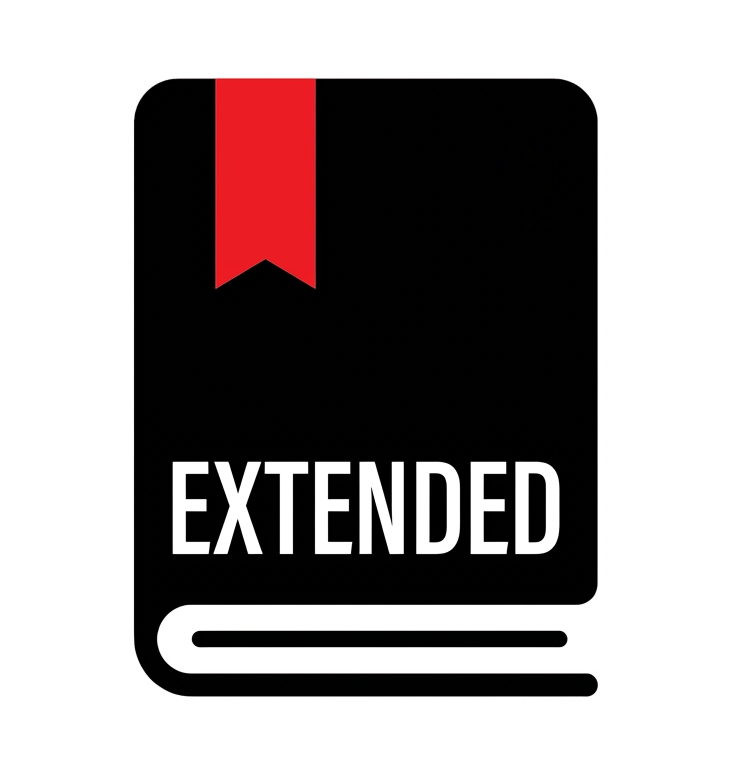

<div align="center">



# OpenlibExtended

**The ultimate open-source client for Anna's Archive. Download, organize, and read your favorite books on any device.**

[](https://flutter.dev/)
[](https://opensource.org/licenses/)
[](https://github.com/warreth/OpenlibExtended/releases)
[](https://github.com/warreth/OpenlibExtended/releases)

[](https://github.com/warreth/OpenlibExtended/releases)
</div>

## Features ✨

- **Cross-Platform Support**
  Native performance on Android, iOS, Windows, Linux, and macOS.

- **Resilient Downloads**
  Multi-instance engine automatically balances and fails over between mirrors to guarantee downloads.

- **Advanced Search**
  Filter by language, extension, and year. Includes instant search suggestions as you type.

- **Built-in Reader**
  Integrated EPUB and PDF reader with customizable tap zones and gesture support.

- **Library Management**
  Track your collection, discover trending books, and export files to other apps.

## Star History ⭐️

[](https://star-history.com/#warreth/OpenlibExtended&Date)

## Roadmap 🎯

- [ ] **Web Version**: Run OpenlibExtended directly in your browser.
- [ ] **Cloud Sync**: Sync your library and reading progress with Booklore.
- [ ] **Enhanced Formats**: Native support for CBR, CBZ, and AZW3.
- [ ] **Metadata Editor**: Fix and organize book details manually.
- [ ] MacOs release

## Screenshots 🖼️

[](screenshots/Screenshot_1.png)
[](screenshots/Screenshot_2.png)
[](screenshots/Screenshot_3.png)
[](screenshots/Screenshot_4.png)
[](screenshots/Screenshot_5.png)
[](screenshots/Screenshot_6.png)
[](screenshots/Screenshot_7.png)
[](screenshots/Screenshot_8.png)

## Installation 📦

Grab the latest release from [GitHub Releases](https://github.com/warreth/OpenlibExtended/releases).

**Note:** Publishing this app to the Play Store violates their terms.

## Development 🛠️

```bash
git clone https://github.com/warreth/OpenlibExtended.git
flutter pub get
flutter run
```

See [CONTRIBUTING.md](CONTRIBUTING.md) for guidelines.

## Donate 🎁

If you like the app, consider supporting the original source or the development of this client.

- [**Donate To Anna’s Archive**](https://annas-archive.org/donate?tier=1) (Support the library itself)
- [**Sponsor me on GitHub 💖**](https://github.com/sponsors/warreth) (Support the app development)

## License 📜

Licensed under [AGPL v3.0](https://www.gnu.org/licenses/agpl-3.0.html).

## Disclaimer ⚠️

OpenlibExtended does not own or have any affiliation with the books available through the app. All books are the property of their respective owners and are protected by copyright law. OpenlibExtended is not responsible for any infringement of copyright or other intellectual property rights that may result from the use of the books available through the app. By using the app, you agree to use the books only for personal, non-commercial purposes and in compliance with all applicable laws and regulations.
